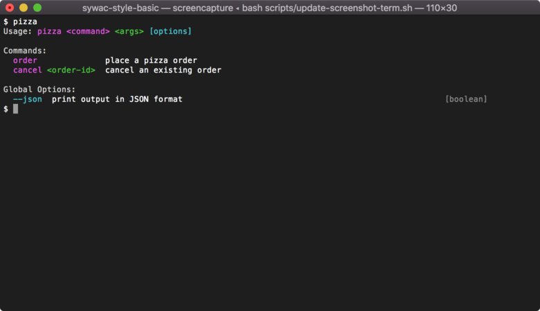
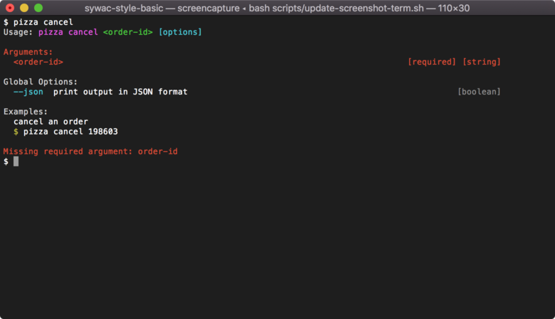

# sywac-style-basic

> Basic color styling for your sywac CLI

[](https://travis-ci.com/sywac/sywac-style-basic)
[](https://coveralls.io/github/sywac/sywac-style-basic?branch=master)
[](https://standardjs.com)





Easily add "basic" color styling to your sywac CLI:

```js
// cli.js
const cli = require('sywac')
const basicStyle = require('sywac-style-basic')
cli.style(basicStyle)
```

This will add style hooks to make your CLI help text colorful/pretty.

Note that this package DOES NOT wrap/include/come with sywac - you should have sywac as a sibling dependency.

Visit http://sywac.io/docs/sync-config.html#style for detailed documentation.

## Install

Install sywac and this package together, saving them as production dependencies in your package.json file:

```console
$ npm i -P sywac sywac-style-basic
```

See code snippet above for usage.

## Related

- [sywac](https://sywac.io/) - The CLI library you should be using with this package
- [chalk](https://github.com/chalk/chalk) - The library used by this package to make pretty colors
- [@tryghost/pretty-cli](https://www.npmjs.com/package/@tryghost/pretty-cli) - Wraps/exposes a sywac instance preconfigured with its own opinionated styling
- [cies](https://github.com/nexdrew/cies) - Example of a CLI that uses this package

## License

MIT © Andrew Goode
